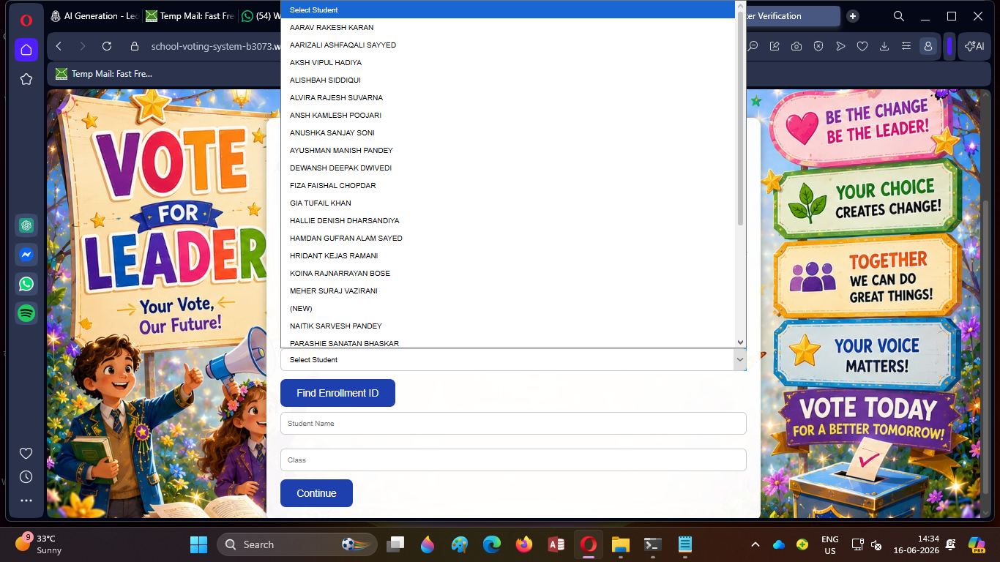
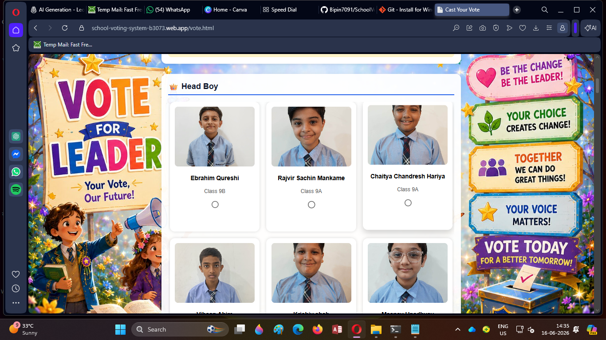
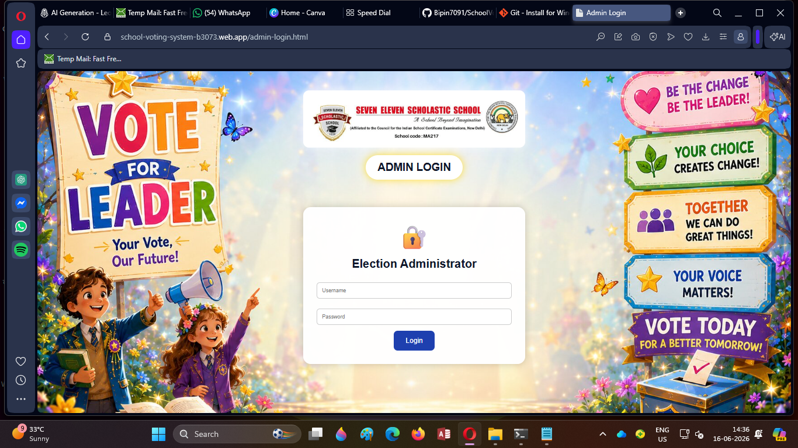
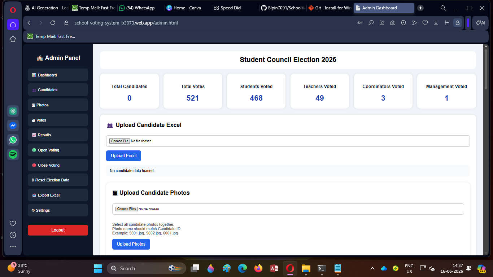

# 🗳 School Election Voting System

A complete digital election platform developed and deployed for conducting school elections in a secure, transparent, and efficient manner.

This project was designed to replace traditional paper-based voting with a modern web-based voting system, allowing students, teachers, coordinators, and management members to participate in the election process digitally.

## 🌐 Live Project

### Student Voting Portal

https://school-voting-system-b3073.web.app

### Admin Login Portal

https://school-voting-system-b3073.web.app/admin-login.html

## ✨ Key Features

* Student verification using Enrollment ID
* Teacher, Coordinator, and Management voting
* Candidate profile display with photographs
* Secure one-vote-per-user workflow
* Voting review and confirmation page
* Admin login and election management
* Firebase Firestore integration
* Real-time election data management
* Mobile-friendly responsive design
* Live deployment using Firebase Hosting

## 👥 Voting Positions Supported

* Head Boy
* Head Girl
* Jr Head Boy
* Jr Head Girl
* Jr Head Boy (Afternoon)
* Jr Head Girl (Afternoon)
* House Captain
* Discipline Incharge
* Sports Captain
* Peer Leaders

## 🛠 Technologies Used

* HTML5
* CSS3
* JavaScript (ES6)
* Firebase Hosting
* Firebase Firestore
* Git & GitHub

## 📸 Project Screenshots

Project screenshots and election-day photos can be found in the repository.

## 🎯 Project Objective

To provide a secure, organized, and transparent digital voting experience for school elections while reducing manual work and improving election management.

## 👨‍💻 Developer

**Bipin Yadav**

Designed, developed, tested, deployed, and managed the complete election platform for a real school election event.

GitHub Profile:
https://github.com/Bipin7091

Repository:
https://github.com/Bipin7091/SchoolVotingApp

## 📈 Real World Usage

This platform was successfully used during a real school election event involving students, teachers, coordinators, and management members.

## 🚀 Deployment

Hosted using Firebase Hosting.

Live URL:
https://school-voting-system-b3073.web.app

## 📸 Project Screenshots

### Student Voting Portal

#### Voter Verification Page

#### Voting Interface

---

### Admin Portal

#### Admin Login

#### Admin Dashboard

This platform was successfully used during a real school election involving students, teachers, coordinators, and management members.

## 🏆 Project Highlights

* Developed a complete end-to-end election management platform.
* Implemented role-based voting workflows.
* Integrated Firebase Firestore for secure data storage.
* Deployed and managed a live production system.
* Used in an actual school election event.

